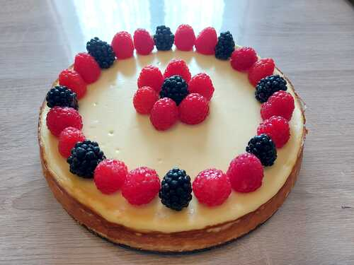

<!-- omit in toc -->
# Cheese Cake Keto

<!-- omit in toc -->
## Cuprins

- [Ingrediente](#ingrediente)
  - [Blat](#blat)
  - [Crema](#crema)
- [Vase, ustensile si aparate](#vase-ustensile-si-aparate)
- [Instructiuni](#instructiuni)
- [Notite](#notite)

## Ingrediente

### Blat

- 2 cupe de faina de migdale
- 1/2 cupa faina cocos
- 120 g unt
- 1 lingura substitut zahar (1:1)
- 1/2 lingurita xanthan gum
- esenta de vanilie, rom si lamaie
- sare

### Crema

- 1 kg branza crema (Philadephia)
- 150 g frisca lichida grasa
- 4 oua
- 4-6 liguri substitut zahar (1:1)
- 1/4 lingurita xanthan gum
- esenta de vanilie, rom si lamaie 

## Vase, ustensile si aparate

Forma rotunda de tort.
Robot de bucatarie cu cutite.
Mixer de bucatarie

## Instructiuni

### Blat

Amestecati toate ingredientele in robot la cutite.  
Intindeti blatul in forma de tort si coaceti la 180 grade C timp de 8 minute pana se rumeneste usor.

### Crema

Amestecati 1 lingura zahar cu xanthan gum.  
Separat, restul de ingrediente le adaugati pe rand intr-un bol, in timp ce amestecati continuu cu mixerul.  
La final, incorporati amestecul de xanthan gum.  
Turnati crema in forma de tort peste blat.
Se coace la 230 de grade C pentru 10 minute, apoi la 100 de grade pentru 1 ora, sau pana ce temperatura interna ajunge la 65 de grade.

## Notite

Tava de tort se unge bine si se foloseste folie de copt.  
Crema trebuie sa aiba compozitia unui iaurt gros ca totusi curge.  
Se decoreza cu fructe.
