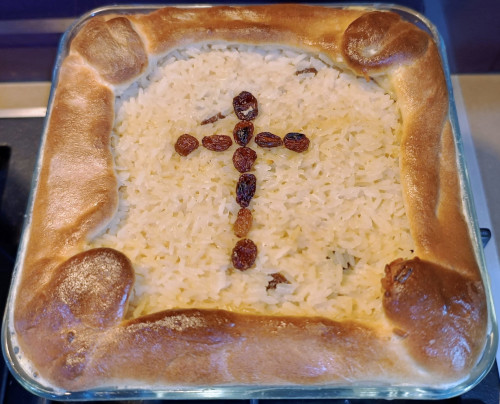

# Pasca cu orez

Aceasta reteta se face de obicei in tandem cu reteta de [cozonac](../cozonac-usor) deoarece aluatul are aceiasi compozitie.  
Folosind aceasta reteta puteti face 1.5 kg de pasca cu orez.  
Reteta foloseste un aparat de facut paine si oala sub presiune, pentru a usura munca considerabil.  

## Cuprins

1. [Ingrediente](#ingrediente)
2. [Vase, ustensile si aparate](#vase-ustensile-aparate)
3. [Instructiuni](#instructiuni)
4. [Notite](#notite)

## Ingrediente

### Aluat

- 1/2 lingurita de sare
- 2 galbenusuri medii
- 100 g zahar
- 75 g unt/untura
- 150 ml lapte
- 300-400 g faina de paine
- 1 lingura extract vanilie/ 1 lingurita esenta vanilie
- 1 linguri rom / 1 lingurita esenta rom
- 1 pliculet de drojdie instant (7g)

### Umplutura

- 1/2 lingurita de sare
- 500 g orez
- 750 ml lapte
- 2 albusuri si 2 oua intregi
- 2 linguri extract vanilie/ 2 lingurite esenta vanilie
- 2 linguri zeama lamaie / 2 lingurite esenta lamaie
- 200g zahar
- 100g stafide

## Vase, ustensile si aparate

- Aparat de facut paine sau un mixer cu bol.
- Oala sub presiune gen InstantPot
- 1 tava de cuptor
- 1 facalet

## Instructiuni

Adaugati toate ingredientele aluatului intr-un bol, in ordinea listata.

- Folosind aparatul de paine, setati programul pentru aluat si crescut, de 1 ora si jumatate. (Ex. Marca Ambiano programul 17).
- Alternativ framantati 15 min, folosind mixerul cu bol, incepand cu viteza cea mai mica si crescand treptat. Apoi acoperiti si lasati in loc caldut la crescut pentru 1 ora si 15 minute.

Cat aluatul creste, preparati umplutura.

 - Spalati bine orezul in mai multe ape.
 - Adaugati 500g orez, 500g ml lapte si sarea in oala cu presiune si fierbeti din momentul inchiderii 3 minute. Apoi lasati sa se opreasca presiunea singura aprox 22 de minute.
 - Scoateti orezul si amestecati-l cu restul de lapte si ingrediente.

 ...TBC

Ungeti bine tava de cuptor.  
Modelati aluatul folosind facaletul si faina intr-o fasie subtire mare pe care o puneti in tava de cuptor ca o foaie de copt cu marginile putin pe afara.
Adaugati compozitia in tava si intindeti bine, apoi treceti putin marginile de aluat peste compozitie.
Coaceti pasca 40-45 de minute in cuptor cu ventilator, la 180 de grade, tava pusa la mijloc sau putin mai jos.

Puteti testa daca este copt cu un termometru cu sonda, temperatura trebuie sa depaseasca 75 de grade in mijloc. 
Cand testati temperatura puteti unge si cu putin ou batut deasupra pentru aspect. 

## Notite

Proportia de ingrediente pentru aluat este de 400 ml lichid la 600 g faina insa cantitatea de faina poate varia considerabil.  
Grasimile si galbenusurile se considera jumate din aportul de lichid.  
Becul cuptorului degaja caldura ce ajuta la cresterea aluatului.  
Daca drojdia e mai veche, o poti activa mai intai in putina apa cu zahar, pentru siguranta.
