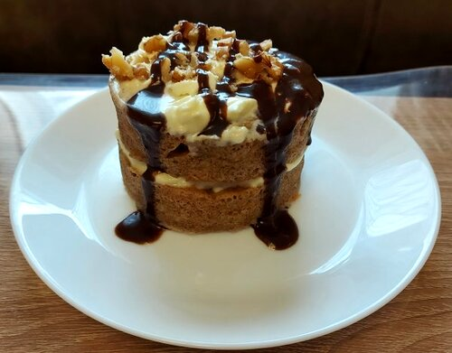

<!-- omit in toc -->
# Prajitura cu morcov (Keto)

Prajitura cu morcov este una din cele mai reusite prajituri keto.

<!-- omit in toc -->
## Cuprins

- [Ingrediente](#ingrediente)
  - [Condimente si plante aromatice](#condimente-si-plante-aromatice)
  - [Restul de ingrediente](#restul-de-ingrediente)
- [Vase, ustensile si aparate](#vase-ustensile-si-aparate)
- [Instructiuni](#instructiuni)
- [Notite](#notite)

## Ingrediente

### Condimente si plante aromatice

1/2 lingurita scortisoara (cinamon)
1/2 lingurita pumpkin spice
1/4 lingurita praf de copt
1.5 linguri erythritol (inlocuitor de zahar, indulcitor)

### Restul de ingrediente

1 ou
1 lingura unt
1 lingura lapte de cocos
2 linguri faina de migdale
3 linguri de mieji de nuca taiati marunt
1 morcov mediu ras (sau 2 mai mici)

## Vase, ustensile si aparate

Un vas mic (350-400ml) rezistent la microunde.
Cuptor cu microunde.

## Instructiuni

Topiti untul la microunde in vasul mentionat la pasul anterior. Intre timp dati morcovul prin razatoare.  
Dupa ce s-a topit untul, amestecati restul de ingrediente.

Puneti la microunde pentru 3-5 minute (Mijocul sa se simta tare la atins) (ex. 3.5 min la 900w)

## Notite

Se poate coace si la cuptor, la 180 de grade fan, pentru 20-25 de minute.
Poate fi servit cu diferite sosuri keto.
