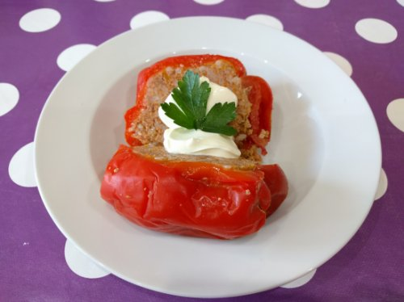

<!-- omit in toc -->
# Ardei Umpluti

<!-- omit in toc -->
## Cuprins

- [Ingrediente](#ingrediente)
  - [Condimente si plante aromatice](#condimente-si-plante-aromatice)
  - [Umplutura](#umplutura)
  - [Restul](#restul)
  - [Optional](#optional)
- [Vase, ustensile si aparate](#vase-ustensile-si-aparate)
- [Instructiuni](#instructiuni)
- [Notite](#notite)

## Ingrediente

### Condimente si plante aromatice

- 1 ligura sare
- 1 lingurita rasa oregano
- 1 lingurita rasa cimbru
- 1 lingurita rasa boia sau boia usor iute
- piper dupa gust

### Umplutura

- 750g carne tocata (vaca si porc)
- 50g slanina afumata
- 125g orez (3/4 ceasca)
- 150g bulion (5 linguri)
- 1 morcov mediu
- 1/2 telina medie
- 1 ceapa medie

### Restul

- 8 ardei grasi
- 4 rosii medii
- 3 linguri ulei
- 2 litri apa

### Optional

- smantana
- patrunjel
- ardei iute - ciusca
- zeama de lamaie

## Vase, ustensile si aparate

- Vas de 4 litri
- Bol mare de sticla sau plastic
- Cutit bucatar si fund de lemn
- Curatator legume sau cutit de curatat
- Robot bucatarie cutite
- Aragaz

## Instructiuni

Spalam, curatam legumele si scoatem cotoarele din ardei.
Facem 8 capace din rosii.

Taiem slanina cat mai marunt. Clatim usor carnea tocata.

Morcovul, ceapa si telina le bagam in robot la cutite.

Adaugam toate condimentele si ingredientele pentru umplutura in bolul de sticla.
Amestecam bine cu mana. Apoi indesam umplura in ardei, lasand putin loc pana la sus.
Punem capacele din rosii la fiecare ardei.

Inghesuim ardeii in cratita, adaugand apa si uleiul.

Lasam la foc mic sa fiarba aproximativ 1h:20min.

Se serveste neaparat cu smanata. Cei ce prefera cu iaurt ... sa le fie rusine :).
De asemenea se poate servi cu cateva frunze de patrujel si un ardei iute.

Pofta buna!

## Notite

Slanina afumata da un gust deosebit ardeilor umpluti, recomandam sa nu o sariti.  
Daca doriti un gust putin acrisor, puteti adauga zeama de lamaie cu 5 minute inainte de stigerea focului.  
Daca v-a ramas prea multa umplutura, puteti face din rest burrito mexicane.  
