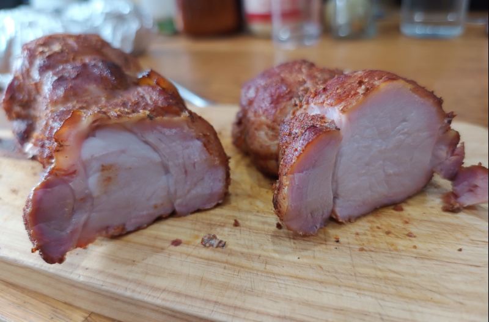

# Jambon Taranesc

Jambonul taranesc se gaseste frecvent in magazinele de mezeluri, insa varianta preparata traditional acasa este tot mai rara.  
Aceasta reteta traditionala este specifica in special regiunilor de nord si nord-est ale Romaniei.

## Cuprins

1. [Ingrediente](#ingrediente)
2. [Instructiuni](#instructiuni)
3. [Notite](#notite)

## Ingrediente

- 1kg spata de porc fara os
- 15g sare
- 4g usturoi granulat
- 3g zahar
- 1g piper
- 1g cimbru
- 1g coriandru seminte
- 1g chimen
- 1g ienibahar

## Instructiuni

Indepartati soriciul si portionati pulpa in bucati de dimensiuni aproximativ egale.  
Frecati fiecare bucata cu sare si lasati la rece timp de 24-48 de ore, in functie de grosimea bucatilor.  
Cu maximum 10 ore inainte de preparare, presarati restul de condimente pe bucatile carne.  
Jambonul se gateste la temperatura scazuta in afumatoare, intre 90-110 grade Celsius, timp de 3-4 ore la fum cald, pana cand ajunge la 65 de grade Celsius in bucatile mai groase de carne.  
Folositi lemn de cires, mar sau prun pentru a obtine o aroma usor dulceaga. 

## Notite

Pentru o aroma de fum mai intensa, se poate afuma la rece timp de cateva ore (in functie de temperatura de afara) inainte de gatire.
